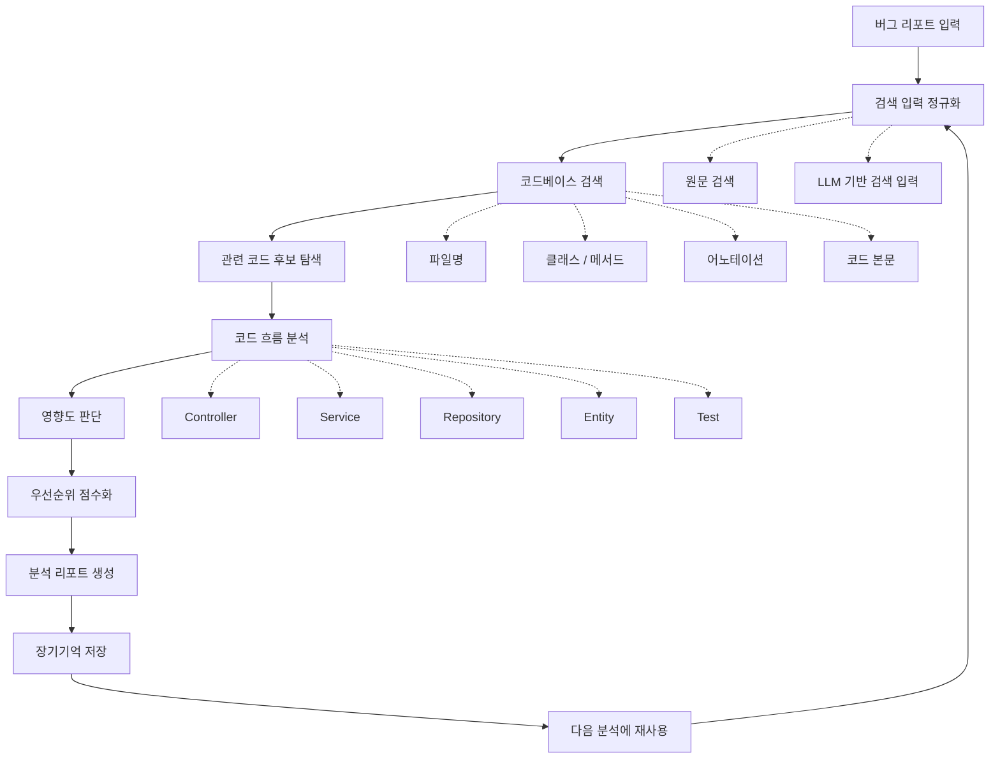
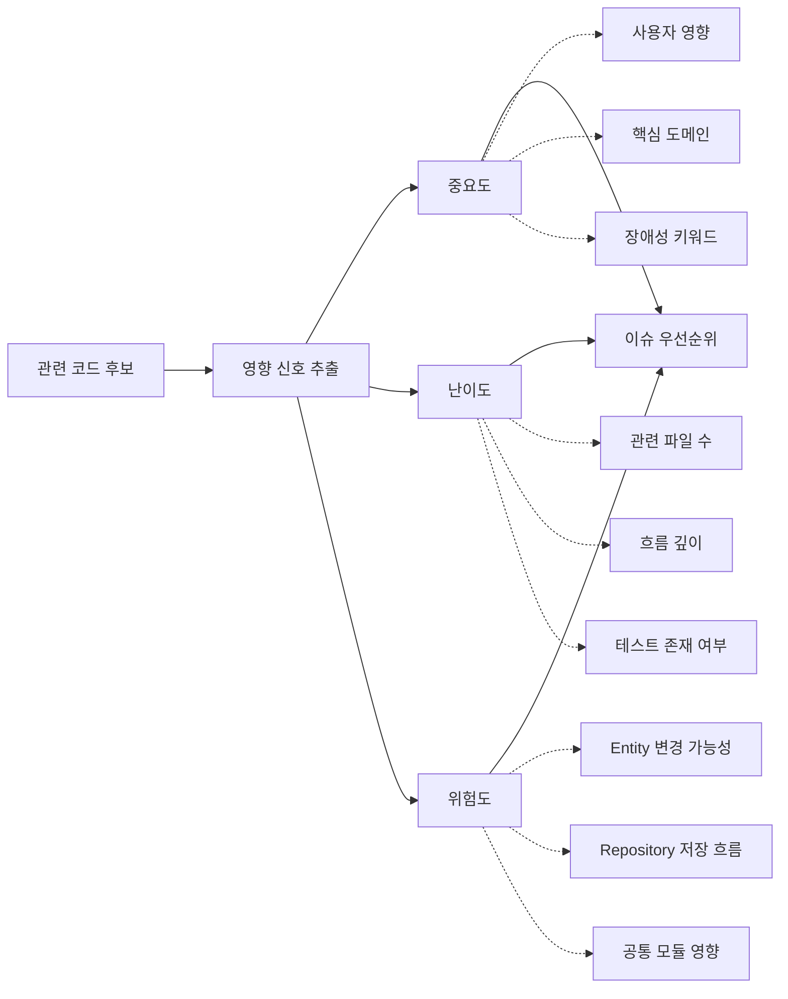
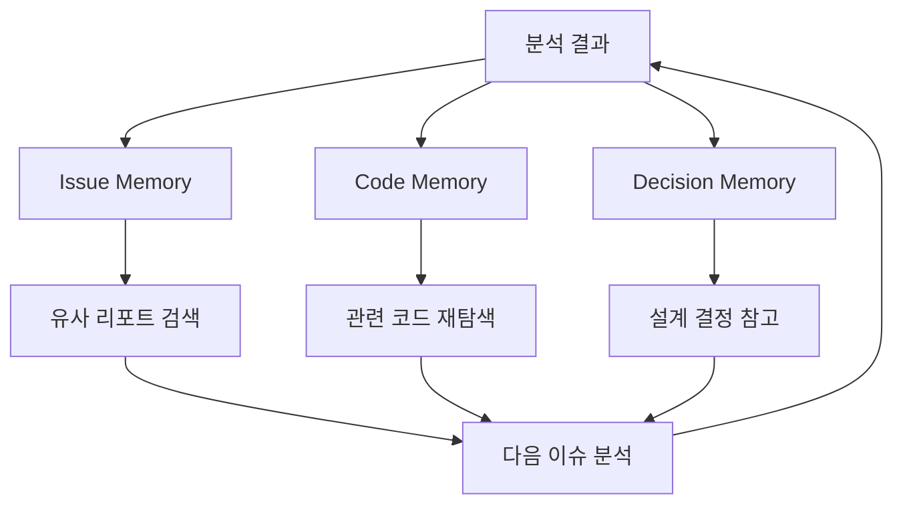

# Clio

Clio는 버그 리포트를 코드베이스와 연결해, 이슈의 우선순위를 판단하는 로컬 코드 분석 서비스입니다.

버그 리포트는 항상 개발자가 작성하지 않습니다. 사용자는 "결제는 됐는데 주문 내역에 안 보여요"라고 말하고, 운영자는 "특정 상태 전이가 누락된 것 같다"고 말하며, 개발자는 "PaymentService 이후 Order 상태 변경 흐름이 의심된다"고 말합니다.

Clio는 이런 서로 다른 표현을 코드베이스 위에서 해석합니다. 리포트에서 출발해 관련 코드 후보를 찾고, 코드 흐름과 테스트 존재 여부, 도메인 영향 범위를 함께 살펴본 뒤, 이 이슈가 얼마나 중요하고 어려우며 위험한지 판단하는 것을 목표로 합니다.

## Why Clio

많은 팀에서 이슈 우선순위는 회의와 감에 의존합니다.

누군가는 "이거 쉬울 것 같은데요"라고 말하고, 누군가는 "결제 쪽이라 위험할 것 같습니다"라고 말합니다. 하지만 실제로 어떤 코드가 엮여 있는지, 테스트가 있는지, 도메인 영향이 얼마나 넓은지는 코드를 보기 전까지 알기 어렵습니다.

Clio는 이 판단을 코드베이스 위에서 시작하게 만듭니다.

버그 리포트가 들어오면 관련 코드를 찾고, 영향 범위를 추정하고, 우선순위를 설명 가능한 형태로 정리합니다. 목표는 개발자를 대체하는 것이 아니라, 개발자가 이슈를 더 빨리 이해하고 더 나은 순서로 처리할 수 있게 돕는 것입니다.

## Analysis Flow

Clio의 분석은 하나의 질문에서 시작합니다.

> 이 버그는 지금 처리해야 하는 중요한 문제인가?

이 질문에 답하기 위해 Clio는 리포트 원문, 코드 구조, 도메인 신호, 테스트 존재 여부, 과거 분석 결과를 함께 봅니다.



## From Report to Code

사용자가 입력한 리포트는 코드와 바로 매칭되지 않는 경우가 많습니다.

```text
결제는 완료됐는데 주문 내역에 보이지 않습니다.
카드 승인 문자는 받았지만 앱에서는 주문이 없는 것으로 나옵니다.
```

Clio는 이 문장을 특정 클래스나 메서드로 바로 단정하지 않습니다. 먼저 코드 검색에 사용할 수 있는 입력으로 정리합니다.

```text
raw report:
- 결제는 완료됐는데 주문 내역에 보이지 않습니다.

candidate domains:
- Payment
- Order

code search terms:
- payment
- order
- history
- status
```

이 단계의 목적은 정답을 추론하는 것이 아닙니다. 코드베이스에서 관련 후보를 더 잘 찾기 위한 검색 입력을 만드는 것입니다.

## Code-Based Priority

Clio는 LLM이 감으로 우선순위를 정하게 만들지 않습니다.

우선순위는 코드베이스에서 찾은 근거를 기반으로 판단합니다. LLM은 리포트를 검색 가능한 입력으로 바꾸거나, 분석 결과를 사람이 읽기 좋은 설명으로 정리하는 데 사용됩니다.



예를 들어 결제 이후 주문 상태가 갱신되지 않는 문제라면 다음 신호가 중요합니다.

- 결제 도메인과 주문 도메인이 함께 관련되는가
- Entity 상태 변경이 포함되는가
- Repository 저장 흐름이 포함되는가
- 외부 결제 API나 webhook 흐름이 관련되는가
- 관련 테스트가 부족한가
- 여러 서비스 계층을 거쳐야 하는가

이 정보는 단순한 키워드 검색만으로 알기 어렵습니다. Clio는 코드베이스의 구조적 정보를 사용해 이슈의 수정 범위와 변경 위험을 추정합니다.

## Memory Loop

Clio의 분석 결과는 일회성으로 끝나지 않습니다.

이슈 분석이 쌓일수록 프로젝트에 대한 장기기억이 만들어집니다. 과거 리포트, 관련 코드, 수정 방향, 설계 결정은 이후 유사 이슈를 분석할 때 다시 사용됩니다.



Clio가 관리하려는 기억은 크게 세 가지입니다.

- **Issue Memory**: 과거 버그 리포트, 분석 결과, 실제 수정 방향, 유사 이슈 패턴
- **Code Memory**: 코드 chunk, 도메인별 주요 클래스, 자주 함께 변경되는 파일, 테스트 신호
- **Decision Memory**: 설계 결정, 운영 정책, 도메인 규칙, 팀의 판단 근거

예를 들어 과거에도 "결제 성공 후 주문 상태가 갱신되지 않는 문제"가 있었다면, Clio는 유사 리포트와 당시 관련 코드를 함께 참고해 더 나은 후보를 제시할 수 있습니다.

## ERD


