# clio ERD (JPA 엔티티 기준)

`@Entity` 22개를 도메인별로 정리한 관계도. 컬럼은 식별자·FK·핵심 필드 위주로만 적었다.

## 전체 관계도

```mermaid
erDiagram
    PROJECTS ||--o{ PROJECT_SOURCES : has
    PROJECTS ||--o{ PROJECT_CONTEXTS : has
    PROJECTS ||--o{ CODE_FILES : indexes
    PROJECTS ||--o{ BUGS : collects
    PROJECTS ||--o{ ISSUES : groups
    PROJECTS ||--o{ DECISION_MEMORIES : remembers
    PROJECTS ||--o{ ANALYSIS_JOBS : runs
    PROJECTS ||--o{ API_KEYS : issues

    PROJECT_SOURCES ||--o| REPOSITORY_CREDENTIALS : "1:1 token"
    PROJECT_SOURCES ||--o{ ISSUE_BRANCHES : "branch on"
    PROJECT_CONTEXTS ||--o{ PROJECT_CONTEXT_CHUNKS : "chunk+embed"

    CODE_FILES ||--o{ CODE_CHUNKS : "chunk+embed"
    CODE_FILES ||--o{ CODE_SYMBOLS : declares

    BUGS ||--o{ BUG_OCCURRENCES : "raw events"
    BUGS ||--o{ BUG_EMBEDDINGS : embeds
    BUGS ||--o{ BUG_PRIORITY_FEEDBACKS : "priority log"

    ISSUES ||--o{ ISSUE_BUGS : contains
    BUGS   ||--o{ ISSUE_BUGS : "grouped into"
    ISSUES ||--o{ ISSUE_BRANCHES : "fix branch"

    LLM_PROVIDERS ||--o{ LLM_MODELS : offers
    LLM_MODELS ||--o{ ANALYSIS_JOBS : "used by"
    BUGS   ||--o{ ANALYSIS_JOBS : "target(nullable)"
    ISSUES ||--o{ ANALYSIS_JOBS : "target(nullable)"
    ANALYSIS_JOBS ||--o| ANALYSIS_RESULTS : produces

    PROJECTS {
        bigint id PK
        varchar name
        enum status "ProjectStatus"
        instant created_at
        instant updated_at
    }
    PROJECT_SOURCES {
        bigint id PK
        bigint project_id FK
        varchar repo_url
        varchar target_branch
        varchar root_path
        enum sync_status
        instant last_synced_at
    }
    REPOSITORY_CREDENTIALS {
        bigint id PK
        bigint project_source_id FK "UNIQUE 1:1"
        varchar token_secret_ref
    }
    PROJECT_CONTEXTS {
        bigint id PK
        bigint project_id FK
        varchar title
        enum type "ProjectContextType"
        text content
        varchar source_path
        varchar source_url
    }
    PROJECT_CONTEXT_CHUNKS {
        bigint id PK
        bigint context_id FK
        int chunk_index
        text content
        vector embedding
        varchar embedding_model
    }
    CODE_FILES {
        bigint id PK
        bigint project_id FK
        varchar path "UK(project_id,path)"
        varchar file_name
        varchar language
        boolean test
        bigint size_bytes
        varchar content_hash
        instant indexed_at
    }
    CODE_CHUNKS {
        bigint id PK
        bigint file_id FK
        varchar path
        varchar symbol_name
        enum chunk_type
        int start_line
        int end_line
        text content
        vector embedding
    }
    CODE_SYMBOLS {
        bigint id PK
        bigint file_id FK
        varchar name
        varchar qualified_name
        varchar signature
        enum type "CodeSymbolType"
        varchar package_name
        int start_line
        int end_line
    }
    BUGS {
        bigint id PK
        bigint project_id FK
        varchar fingerprint "UK(project_id,fingerprint)"
        varchar fingerprint_source
        varchar title
        enum source "BugSource"
        varchar error_type
        text normalized_message
        varchar top_application_frame
        int occurrence_count
        enum status "BugStatus"
        enum severity
        instant first_seen_at
        instant last_seen_at
    }
    BUG_OCCURRENCES {
        bigint id PK
        bigint bug_id FK
        enum source
        jsonb raw_payload
        instant occurred_at
    }
    BUG_EMBEDDINGS {
        bigint id PK
        bigint bug_id FK
        vector embedding
        varchar embedding_model
        int embedding_dimension
    }
    BUG_PRIORITY_FEEDBACKS {
        bigint id PK
        bigint bug_id FK
        enum previous_priority
        enum new_priority
        text reason
    }
    ISSUES {
        bigint id PK
        bigint project_id FK
        varchar title
        text summary
        enum status "IssueStatus"
        enum priority
        enum severity
        int risk_score
        varchar assignee_name
        decimal ai_confidence "5,4"
        int bug_count
        int occurrence_count
    }
    ISSUE_BUGS {
        bigint id PK
        bigint issue_id FK "UK(issue_id,bug_id)"
        bigint bug_id FK
        decimal confidence
        enum grouped_by "IssueGroupingMethod"
    }
    ISSUE_BRANCHES {
        bigint id PK
        bigint issue_id FK
        bigint project_source_id FK
        varchar branch_name
        varchar base_branch
        enum merge_status
        varchar pull_request_url
        instant last_checked_at
    }
    DECISION_MEMORIES {
        bigint id PK
        bigint project_id FK
        varchar title
        text body
        vector embedding
        varchar embedding_model
    }
    ANALYSIS_JOBS {
        bigint id PK
        bigint project_id FK
        bigint bug_id FK "nullable"
        bigint issue_id FK "nullable"
        bigint llm_model_id FK "nullable"
        enum status "AnalysisJobStatus"
        enum search_mode "SearchMode"
        instant started_at
        instant completed_at
        varchar failure_reason
    }
    ANALYSIS_RESULTS {
        bigint id PK
        bigint job_id FK "UNIQUE 1:1"
        int difficulty_score
        int risk_score
        varchar issue_type
        varchar keywords
        varchar domains
        text summary
        text rationale
        text recommended_fix
        text recommended_tests
        jsonb related_code
        jsonb flows
        jsonb similar_issues
        jsonb related_decisions
        jsonb evidence_warnings
    }
    LLM_PROVIDERS {
        bigint id PK
        varchar name
        enum provider_type
        varchar base_url
        varchar api_key_secret_ref
        boolean enabled
    }
    LLM_MODELS {
        bigint id PK
        bigint provider_id FK
        varchar name
        enum purpose "LlmModelPurpose"
        int context_window
        int embedding_dimension
        boolean default_model
        boolean enabled
    }
    API_KEYS {
        bigint id PK
        bigint project_id FK
        varchar name
        varchar key_prefix
        varchar key_hash "UK"
        boolean revoked
        instant last_used_at
    }
    ADMIN_ACCOUNTS {
        bigint id PK
        varchar username "UK"
        varchar password_hash
        boolean must_change_password
    }
```

## 도메인 묶음

| 도메인 | 테이블 |
|---|---|
| project | `projects`, `project_sources`, `repository_credentials`, `project_contexts`, `project_context_chunks` |
| code | `code_files`, `code_chunks`, `code_symbols` |
| bug | `bugs`, `bug_occurrences`, `bug_embeddings`, `bug_priority_feedbacks` |
| issue | `issues`, `issue_bugs`, `issue_branches` |
| analysis | `analysis_jobs`, `analysis_results` |
| memory | `decision_memories` |
| system | `llm_providers`, `llm_models` |
| mcp | `api_keys` |
| user | `admin_accounts` |

## 읽는 포인트

- **`projects`가 모든 것의 루트다.** 8개 테이블이 직접 `project_id`를 들고 있다.
- **Bug → Issue는 `issue_bugs` 조인 테이블(N:M)**이지만 실제로는 "버그를 이슈로 묶는" 그룹핑이며,
  `confidence` · `grouped_by`로 묶은 근거를 남긴다.
- **임베딩 저장 위치가 세 갈래다** — `bug_embeddings`(별도 테이블), `code_chunks` / `project_context_chunks` /
  `decision_memories`(엔티티 내부 컬럼). Bug만 1:N 구조라 모델 교체 시 복수 벡터를 들 수 있다.
- **`analysis_jobs`의 `bug_id` · `issue_id`는 둘 다 nullable** — 버그 단위/이슈 단위 분석을 한 테이블로 받는다.
  DB 제약으로 "둘 중 하나만" 이 강제되지는 않는다.
- **`admin_accounts`는 어디와도 연결되지 않는다.** 이슈 담당자는 FK가 아니라
  `issues.assignee_name` 문자열이다.
