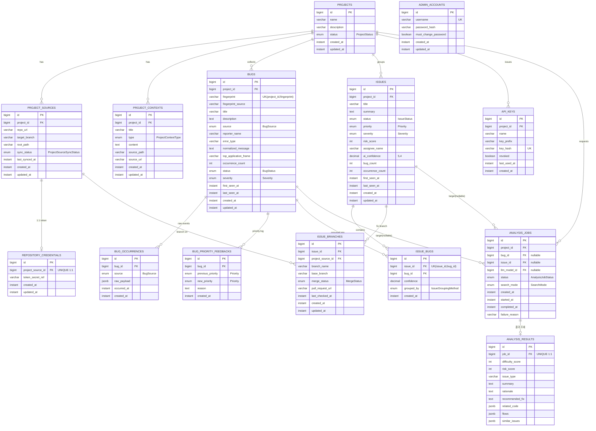

# clio ERD (JPA 엔티티 기준)

`@Entity` 22개를 **어느 서버가 그 테이블을 신경 쓰는가** 기준으로 두 장으로 나눠 그렸다.
이해용이므로 **양쪽에 중복 등장하는 테이블이 있다** (`bugs` · `issues` · `project_contexts` 등).
한쪽 소유라는 뜻이 아니라, 양쪽 다 봐야 하는 테이블이라는 뜻이다.
각 장에는 그 서버가 실제로 쓰는 컬럼만 적었으므로, 같은 테이블도 장마다 보이는 면이 다르다.

컬럼 타입은 JPA 필드 기준 표기다 (`float[]` → `vector`, enum은 `EnumType.STRING`이라 실제 DDL은 varchar).

> 현재 리포는 **엔티티 스켈레톤 단계**다. `JpaRepository` 구현이 0개이고,
> `@RestController`는 아래 3개뿐이다. 그 밖의 분리선은 아직 코드에 없는 설계상의 구분이다.
>
> | 컨트롤러 | 엔드포인트 | 닿는 테이블 |
> |---|---|---|
> | `BugReportController` | `POST·GET /api/v1/projects/{id}/bug-reports` | `bugs`, `bug_occurrences` |
> | `IssueController` | `GET /api/v1/projects/{id}/issues`, `/{issueId}`, `/stats` | `issues`, `issue_bugs` |
> | `LlmSettingsController` | `GET·PATCH·POST /api/v1/system/llm/*` | `llm_providers`, `llm_models` |

---

## 1. Spring Boot API 서버가 신경 쓸 테이블

프로젝트/저장소 설정, 버그 수집·집계, 이슈 관리, 인증, 분석 요청 접수와 결과 조회.

`code_files` · `code_symbols` · `code_chunks` 는 **여기 없다.** API 응답 어디에도 코드 인덱스가 나오지
않고(`IssueDetailResponse` 확인), `code` 패키지에는 엔티티 외에 컨트롤러·서비스·리포지토리가 없다.
전부 2번 소관이다.

`llm_providers` · `llm_models` 는 `LlmSettingsController`(설정 CRUD)가 다루지만, 모델을 실제로 호출하는
쪽이 파이썬이라 2번에 그렸다. `analysis_results` 는 화면 조회에 쓰는 필드만 적었다 — 전체 컬럼은 2번에 있다.

---

## 2. Python AI 서버가 신경 쓸 테이블

저장소 clone, 코드 인덱싱·청킹, 임베딩, 벡터 검색, LLM 분석 실행.

`admin_accounts` · `api_keys` · `issue_branches` · `bug_priority_feedbacks` 는 여기 없다. 분석 파이프라인이
읽을 일이 없다.

---

## 읽는 포인트

- **`projects`가 양쪽 모두의 루트다.** 8개 테이블이 직접 `project_id`를 들고 있다.
- **임베딩 저장 위치가 두 갈래다** — `bug_embeddings`만 별도 테이블(1:N)이고,
  `code_chunks` · `project_context_chunks` · `decision_memories`는 엔티티 내부 컬럼(1:1)이다.
  Bug만 모델 교체 시 복수 벡터를 들 수 있는 구조인데, 의도한 비대칭인지 확인이 필요하다.
- **`analysis_jobs.bug_id` · `issue_id`는 둘 다 nullable** — 버그 단위/이슈 단위 분석을 한 테이블로 받는다.
  DB 제약으로 "둘 중 정확히 하나"가 강제되지 않아, 둘 다 null이거나 둘 다 채워진 행이 들어갈 수 있다.
- **`admin_accounts`는 어디와도 연결되지 않는다.** 이슈 담당자는 FK가 아니라 `issues.assignee_name` 문자열이다.
