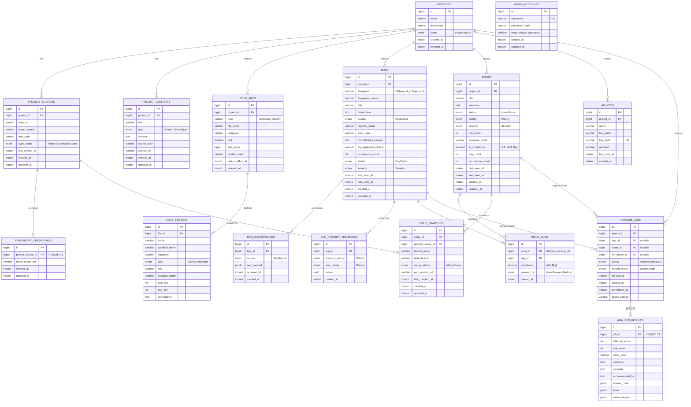

# clio ERD (JPA 엔티티 기준)

`@Entity` 22개를 **어느 서버가 그 테이블을 신경 쓰는가** 기준으로 두 장으로 나눠 그렸다.
이해용이므로 **양쪽에 중복 등장하는 테이블이 있다** (`bugs` · `issues` · `code_files` 등).
한쪽에만 있는 게 아니라, 양쪽 다 봐야 하는 테이블이라는 뜻이다.

컬럼 타입은 JPA 필드 기준 표기다 (`float[]` → `vector`, enum은 `EnumType.STRING`이라 실제 DDL은 varchar).

---

## 1. Spring Boot API 서버가 신경 쓸 테이블

CRUD·조회 API를 제공하고 쓰기를 소유하는 범위. 프로젝트/저장소 설정, 버그 수집·집계, 이슈 관리, 인증.

`analysis_jobs` · `analysis_results`가 여기 있는 이유: **분석 요청 접수와 결과 조회는 API 서버의 일**이다.
잡을 만들고(`PENDING`) 결과를 화면에 내려주는 쪽은 Java고, 그 사이를 채우는 게 파이썬이다.
그래서 `analysis_results`는 조회에 쓰는 필드만 적었다 — 전체 컬럼은 2번에 있다.

---

## 2. Python AI 서버가 신경 쓸 테이블

인덱싱·임베딩·검색·LLM 분석. 벡터를 만들고 잡을 실행해 결과를 채우는 범위.

```mermaid
erDiagram
    PROJECTS ||--o{ PROJECT_SOURCES : "clone 대상"
    PROJECTS ||--o{ CODE_FILES : indexes
    PROJECTS ||--o{ PROJECT_CONTEXTS : has
    PROJECTS ||--o{ BUGS : collects
    PROJECTS ||--o{ ISSUES : groups
    PROJECTS ||--o{ DECISION_MEMORIES : remembers
    PROJECTS ||--o{ ANALYSIS_JOBS : runs

    PROJECT_SOURCES ||--o| REPOSITORY_CREDENTIALS : "1:1 token"

    CODE_FILES ||--o{ CODE_CHUNKS : "chunk+embed"
    CODE_FILES ||--o{ CODE_SYMBOLS : declares
    PROJECT_CONTEXTS ||--o{ PROJECT_CONTEXT_CHUNKS : "chunk+embed"

    BUGS ||--o{ BUG_EMBEDDINGS : embeds
    BUGS ||--o{ BUG_OCCURRENCES : "분석 입력"
    BUGS ||--o{ ISSUE_BUGS : "grouped into"
    ISSUES ||--o{ ISSUE_BUGS : contains

    LLM_PROVIDERS ||--o{ LLM_MODELS : offers
    LLM_MODELS ||--o{ ANALYSIS_JOBS : "used by"
    BUGS   ||--o{ ANALYSIS_JOBS : "target(nullable)"
    ISSUES ||--o{ ANALYSIS_JOBS : "target(nullable)"
    ANALYSIS_JOBS ||--o| ANALYSIS_RESULTS : produces

    PROJECTS {
        bigint id PK
        varchar name
        varchar description
        enum status "ProjectStatus"
    }
    PROJECT_SOURCES {
        bigint id PK
        bigint project_id FK
        varchar repo_url
        varchar target_branch
        varchar root_path
        enum sync_status "ProjectSourceSyncStatus"
        instant last_synced_at
    }
    REPOSITORY_CREDENTIALS {
        bigint id PK
        bigint project_source_id FK "UNIQUE 1:1"
        varchar token_secret_ref
    }
    CODE_FILES {
        bigint id PK
        bigint project_id FK
        varchar path "UK(project_id,path)"
        varchar file_name
        varchar language
        boolean test
        bigint size_bytes
        varchar content_hash
        instant last_modified_at
        instant indexed_at
    }
    CODE_CHUNKS {
        bigint id PK
        bigint file_id FK
        varchar path
        varchar symbol_name
        varchar role
        enum chunk_type "CodeChunkType"
        int start_line
        int end_line
        text content
        varchar content_hash
        vector embedding
        varchar embedding_model
        int embedding_dimension
        instant embedded_at
    }
    CODE_SYMBOLS {
        bigint id PK
        bigint file_id FK
        varchar name
        varchar qualified_name
        varchar signature
        enum type "CodeSymbolType"
        varchar role
        varchar package_name
        int start_line
        int end_line
        text annotations
    }
    PROJECT_CONTEXTS {
        bigint id PK
        bigint project_id FK
        varchar title
        enum type "ProjectContextType"
        text content
    }
    PROJECT_CONTEXT_CHUNKS {
        bigint id PK
        bigint context_id FK
        int chunk_index
        text content
        vector embedding
        varchar embedding_model
        int embedding_dimension
        instant embedded_at
    }
    BUGS {
        bigint id PK
        bigint project_id FK
        varchar fingerprint
        varchar title
        text description
        varchar error_type
        text normalized_message
        varchar top_application_frame
        int occurrence_count
        enum status "BugStatus"
        enum severity "Severity"
    }
    BUG_OCCURRENCES {
        bigint id PK
        bigint bug_id FK
        jsonb raw_payload
        instant occurred_at
    }
    BUG_EMBEDDINGS {
        bigint id PK
        bigint bug_id FK
        vector embedding
        varchar embedding_model
        int embedding_dimension
        instant embedded_at
    }
    ISSUES {
        bigint id PK
        bigint project_id FK
        varchar title
        text summary
        int risk_score
        decimal ai_confidence "5,4"
        int bug_count
        int occurrence_count
    }
    ISSUE_BUGS {
        bigint id PK
        bigint issue_id FK "UK(issue_id,bug_id)"
        bigint bug_id FK
        decimal confidence
        enum grouped_by "IssueGroupingMethod"
    }
    DECISION_MEMORIES {
        bigint id PK
        bigint project_id FK
        varchar title
        text body
        vector embedding
        varchar embedding_model
        int embedding_dimension
        instant embedded_at
    }
    LLM_PROVIDERS {
        bigint id PK
        varchar name
        enum provider_type "LlmProviderType"
        varchar base_url
        varchar api_key_secret_ref
        boolean enabled
    }
    LLM_MODELS {
        bigint id PK
        bigint provider_id FK
        varchar name
        enum purpose "LlmModelPurpose"
        int context_window
        int embedding_dimension
        boolean default_model
        boolean enabled
    }
    ANALYSIS_JOBS {
        bigint id PK
        bigint project_id FK
        bigint bug_id FK "nullable"
        bigint issue_id FK "nullable"
        bigint llm_model_id FK "nullable"
        enum status "AnalysisJobStatus"
        enum search_mode "SearchMode"
        instant started_at
        instant completed_at
        varchar failure_reason
    }
    ANALYSIS_RESULTS {
        bigint id PK
        bigint job_id FK "UNIQUE 1:1"
        int difficulty_score
        int risk_score
        varchar issue_type
        varchar keywords
        varchar domains
        text summary
        text rationale
        text recommended_fix
        text recommended_tests
        jsonb related_code
        jsonb flows
        jsonb similar_issues
        jsonb related_decisions
        jsonb evidence_warnings
        instant created_at
    }
```

읽기만 하는 테이블(`projects` · `bugs` · `issues` · `project_contexts` 등)은 분석에 실제로 쓰는 컬럼만 적었다.
전체 컬럼은 1번에 있다.

---

## 테이블 × 서버 대응

| 테이블 | Spring API | Python AI |
|---|---|---|
| `projects` | 쓰기 | 읽기 |
| `project_sources` | 쓰기 | 읽기 (clone) |
| `repository_credentials` | 쓰기 | 읽기 (clone) |
| `project_contexts` | 쓰기 | 읽기 |
| `project_context_chunks` | — | 쓰기 |
| `code_files` | 읽기 | 쓰기 (인덱싱) |
| `code_symbols` | 읽기 | 쓰기 (파싱) |
| `code_chunks` | — | 쓰기 |
| `bugs` | 쓰기 | 읽기 |
| `bug_occurrences` | 쓰기 | 읽기 |
| `bug_embeddings` | — | 쓰기 |
| `bug_priority_feedbacks` | 쓰기 | — |
| `issues` | 쓰기 | 일부 쓰기 (`risk_score`·`ai_confidence`) |
| `issue_bugs` | 읽기 | 쓰기 (그룹핑) |
| `issue_branches` | 쓰기 | — |
| `analysis_jobs` | 생성·조회 | 상태 전이 |
| `analysis_results` | 읽기 | 쓰기 |
| `llm_providers` / `llm_models` | 설정 CRUD | 읽기 |
| `api_keys` | 쓰기 | — |
| `admin_accounts` | 쓰기 | — |

## 이 표를 보며 정해야 할 것

이 "쓰기 소유" 칸은 **제가 코드에서 읽은 게 아니라 역할에서 추정한 값**입니다. 특히 세 줄이 근거가 약합니다.

1. **`code_files` · `code_symbols`를 파이썬이 쓴다고 뒀습니다.** 청킹·임베딩이 파이썬이면 파일 스캔도 같이 가는 게
   자연스럽지만, Java가 스캔하고 파이썬이 청크만 만드는 분리도 가능합니다. 후자면 파일 하나 인덱싱에 두 서버가 관여합니다.
2. **`repository_credentials`를 파이썬이 읽습니다.** clone 주체가 파이썬이라는 전제인데,
   토큰 접근 주체가 늘어나는 결정이라 따로 볼 값어치가 있습니다.
3. **`issues`를 양쪽이 씁니다.** Java가 상태·담당자를, 파이썬이 `risk_score`·`ai_confidence`를 쓰는 부분 소유입니다.
   같은 행을 두 서버가 갱신하는 유일한 자리입니다.

그리고 두 서버가 **DB를 직접 공유할지, 파이썬이 Java API로만 접근할지**가 위 표 전체의 전제입니다.
지금은 공유를 가정하고 그렸습니다.

## 그 밖에 눈에 띈 것

- **임베딩 저장 위치가 두 갈래다** — `bug_embeddings`만 별도 테이블(1:N)이고,
  `code_chunks` · `project_context_chunks` · `decision_memories`는 엔티티 내부 컬럼(1:1)이다.
  Bug만 모델 교체 시 복수 벡터를 들 수 있는 구조인데, 의도한 비대칭인지 확인이 필요하다.
- **`analysis_jobs.bug_id` · `issue_id`는 둘 다 nullable** — 버그 단위/이슈 단위 분석을 한 테이블로 받는다.
  DB 제약으로 "둘 중 정확히 하나"가 강제되지 않아, 둘 다 null이거나 둘 다 채워진 행이 들어갈 수 있다.
- **`admin_accounts`는 어디와도 연결되지 않는다.** 이슈 담당자는 FK가 아니라 `issues.assignee_name` 문자열이다.
