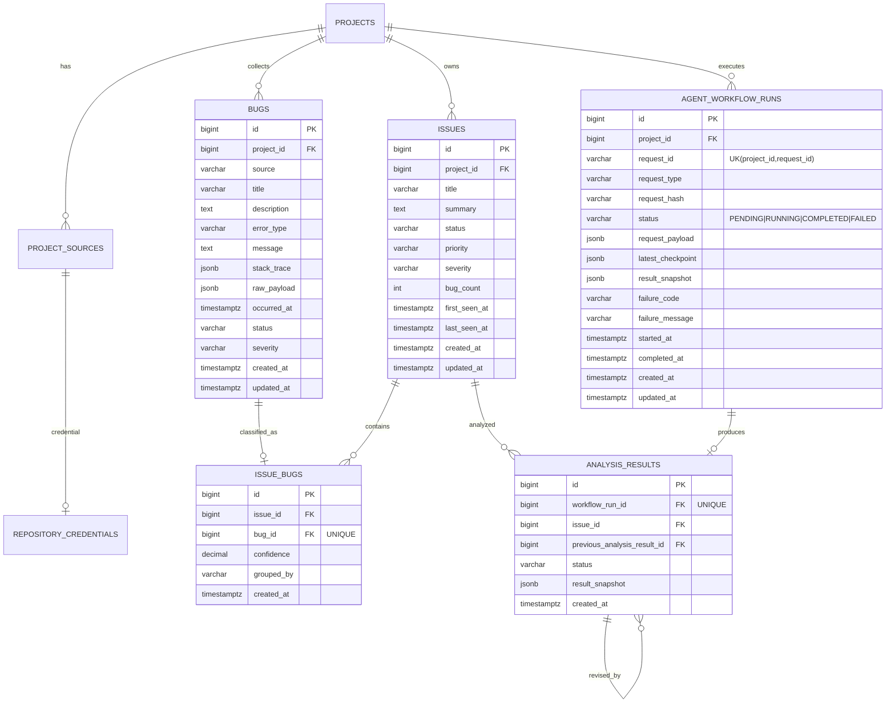
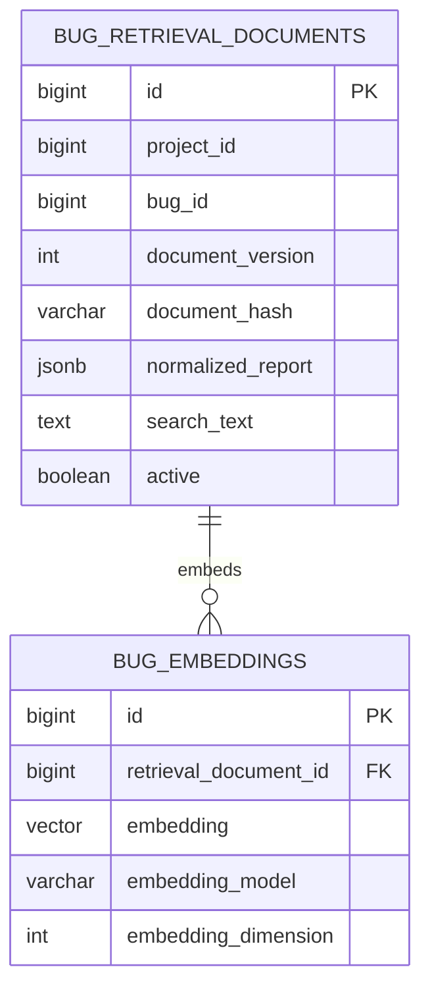

# Clio ERD

Clio는 수집된 오류 한 건을 `Bug`로 저장하고, Agent가 같은 원인으로 판단한 여러
Bug를 하나의 `Issue`에 연결한다. Spring은 lifecycle과 무결성을, Agent는
정규화·검색·판단·분석을 소유한다.

## Spring 핵심 스키마

```mermaid
erDiagram
    PROJECTS ||--o{ PROJECT_SOURCES : has
    PROJECT_SOURCES ||--o| REPOSITORY_CREDENTIALS : credential

    PROJECTS ||--o{ BUGS : collects
    PROJECTS ||--o{ ISSUES : owns
    ISSUES ||--o{ ISSUE_BUGS : contains
    BUGS ||--o| ISSUE_BUGS : classified_as

    PROJECTS ||--o{ AGENT_WORKFLOW_RUNS : executes

    AGENT_WORKFLOW_RUNS ||--o| ANALYSIS_RESULTS : produces
    ISSUES ||--o{ ANALYSIS_RESULTS : analyzed
    ANALYSIS_RESULTS ||--o{ ANALYSIS_RESULTS : revised_by

    BUGS {
        bigint id PK
        bigint project_id FK
        varchar source
        varchar title
        text description
        varchar error_type
        text message
        jsonb stack_trace
        jsonb raw_payload
        timestamptz occurred_at
        varchar status
        varchar severity
        timestamptz created_at
        timestamptz updated_at
    }
    ISSUES {
        bigint id PK
        bigint project_id FK
        varchar title
        text summary
        varchar status
        varchar priority
        varchar severity
        int bug_count
        timestamptz first_seen_at
        timestamptz last_seen_at
        timestamptz created_at
        timestamptz updated_at
    }
    ISSUE_BUGS {
        bigint id PK
        bigint issue_id FK
        bigint bug_id FK "UNIQUE"
        decimal confidence
        varchar grouped_by
        timestamptz created_at
    }
    AGENT_WORKFLOW_RUNS {
        bigint id PK
        bigint project_id FK
        varchar request_id "UK(project_id,request_id)"
        varchar request_type
        varchar request_hash
        varchar status "PENDING|RUNNING|COMPLETED|FAILED"
        jsonb request_payload
        jsonb latest_checkpoint
        jsonb result_snapshot
        varchar failure_code
        varchar failure_message
        timestamptz started_at
        timestamptz completed_at
        timestamptz created_at
        timestamptz updated_at
    }
    ANALYSIS_RESULTS {
        bigint id PK
        bigint workflow_run_id FK "UNIQUE"
        bigint issue_id FK
        bigint previous_analysis_result_id FK
        varchar status
        jsonb result_snapshot
        timestamptz created_at
    }
```

기존 `bug_occurrences`/`bug_reports`, `bug_grouping_decisions`, `bug_match_decisions`, `analysis_jobs`,
`agent_operations`는 제거한다. 이전 `bug_reports`의 각 행은 마이그레이션에서 개별
`bugs` 행으로 보존되며, 기존 Issue 연결도 새 Bug에 복제한다.

인증·관리 및 외부 제품 기능 테이블(`api_keys`, `admin_accounts`,
`project_contexts`, `issue_branches`, `bug_priority_feedbacks`, LLM 설정)은 이번 핵심
리팩터링에서 삭제하지 않는다. 핵심 Agent 계약과 분리해 추후 제품 정책으로 결정한다.

## Agent 소유 스키마

```mermaid
erDiagram
    BUG_RETRIEVAL_DOCUMENTS ||--o{ BUG_EMBEDDINGS : embeds

    BUG_RETRIEVAL_DOCUMENTS {
        bigint id PK
        bigint project_id
        bigint bug_id
        int document_version
        varchar document_hash
        jsonb normalized_report
        text search_text
        boolean active
    }
    BUG_EMBEDDINGS {
        bigint id PK
        bigint retrieval_document_id FK
        vector embedding
        varchar embedding_model
        int embedding_dimension
    }
```

Agent Retrieval DB는 Spring 테이블에 FK를 만들거나 `issues`/`issue_bugs`를 직접
조인하지 않는다. exact·lexical·vector 검색으로 유사 `bug_id`를 얻은 뒤 Spring
internal API에서 해당 Bug들의 Issue 연결 projection을 읽어 후보를 그룹화한다.

PCM은 `pcm_projects`, `pcm_source_events`, `pcm_document_revisions`, `pcm_knowledge`,
`pcm_commits`, `pcm_knowledge_revisions`, `pcm_index_generations`,
`pcm_knowledge_chunks`, `pcm_chunk_embeddings`를 Agent가 독립적으로 소유한다.
